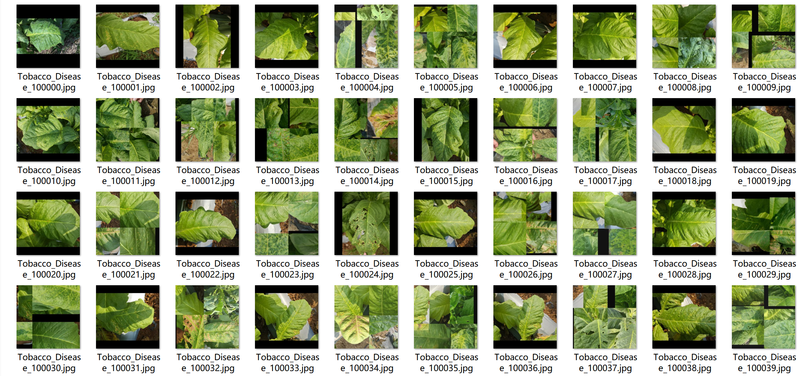
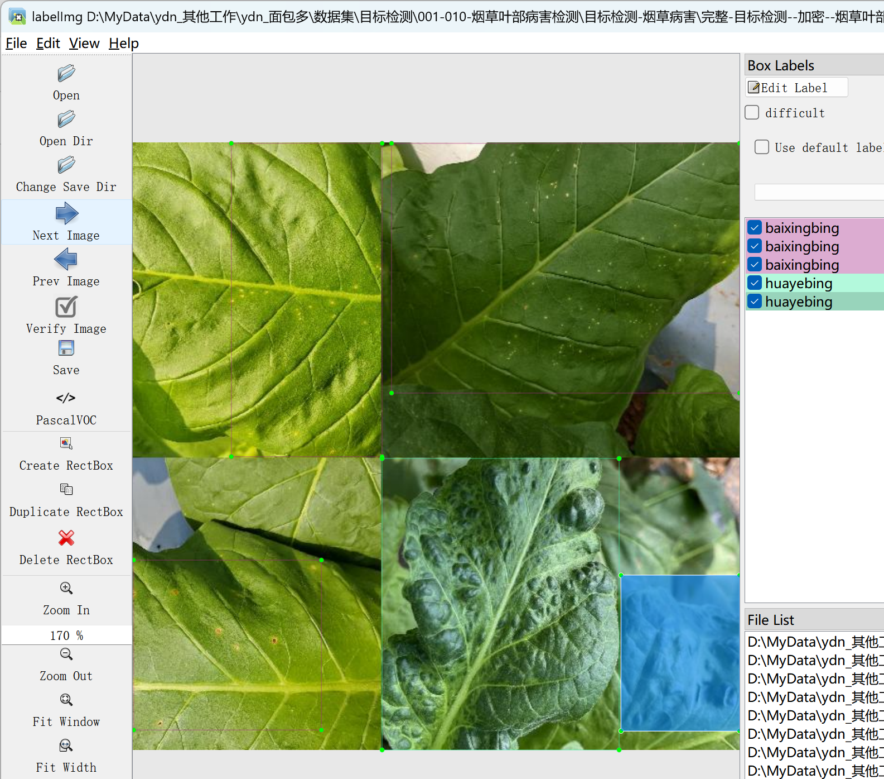

# Tobacco Leaf Disease Detection Dataset

Dataset Information: The dataset consists of 1560 images along with their corresponding annotation files. The annotation files are provided in two formats: VOC (xml) and YOLO (txt).

Annotation Objects: The following objects are annotated:
- Baixingbing
- Huayebing
- Yanqingchong
- Yehuobing

Image Counts and Box Counts for Each Column:
- For each object, the image count and box count information is provided in brackets. The reference Chinese names inside the brackets are used for labeling.

Note: An image may contain multiple objects, so the total number of boxes might be greater than the number of images.

The complete dataset includes three folders and one txt file:
- Image Size Information:
- File Size Information:
- All_txt folder and classes.txt: Stores the YOLO formatted txt annotations, in the same quantity as the images, with each annotation file corresponding to an image.
- classes.txt:
- For a detailed understanding of the standard YOLO format, please search for it on your own. In short, the number 0 corresponds to the name at index 0 in the array in classes.txt.
- All_xml file: VOC formatted xml annotation file.
- Similarly to the annotation files in txt format, the All_xml file is also in the same quantity as the images, with each annotation file corresponding to an image.
- For a detailed understanding of the standard VOC format, please search for it on your own.
- Both formats are usable; choose one based on your preference.

Annotation Screenshots:

## Images

Here is a pay link on Stripe ( https://buy.stripe.com/3cs8yP7sY87d0vu9AB ). Please contact me lonlonago@foxmail.com after funding $89, and I will send you a complete data files , thank you!

